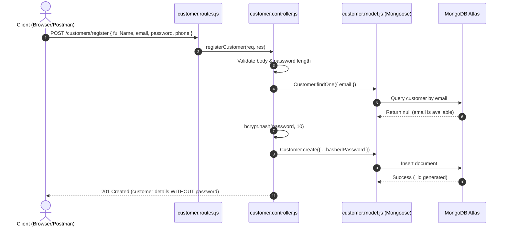
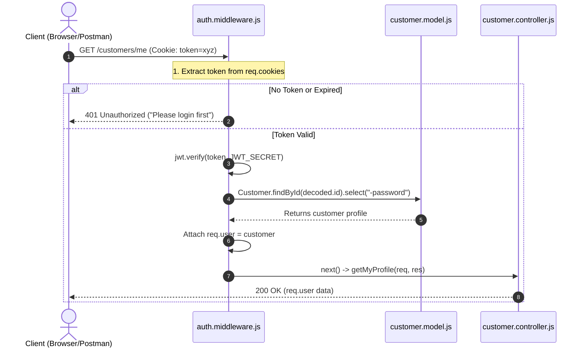

# 🛒 ShopKart Backend — Architecture, Concepts & Developer Reference Guide

> **Target Audience**: Junior Developers, Students & Teaching Assistants  
> **Topic**: Production-Ready Authentication Microservice with Express, Mongoose, JWT, and MVC Architecture  
> **Key Files**: 
> * [index.js](file:///Users/mdkaif/Desktop/MERN%20TA/shopkart-backend/index.js) (Server Entrypoint)
> * [routes/customer.routes.js](file:///Users/mdkaif/Desktop/MERN%20TA/shopkart-backend/routes/customer.routes.js) (API Route Definitions)
> * [controllers/customer.controller.js](file:///Users/mdkaif/Desktop/MERN%20TA/shopkart-backend/controllers/customer.controller.js) (Business Logic)
> * [models/customer.model.js](file:///Users/mdkaif/Desktop/MERN%20TA/shopkart-backend/models/customer.model.js) (Database Schema)
> * [middlewares/auth.middleware.js](file:///Users/mdkaif/Desktop/MERN%20TA/shopkart-backend/middlewares/auth.middleware.js) (JWT Verification)
> * [utils/generateToken.js](file:///Users/mdkaif/Desktop/MERN%20TA/shopkart-backend/utils/generateToken.js) (Token Signing Helper)

---

## 📑 Table of Contents
1. [The Big Picture: From Monolith to MVC Architecture](#1-the-big-picture-from-monolith-to-mvc-architecture)
2. [Database Connectivity with Mongoose & Environment Variables](#2-database-connectivity-with-mongoose--environment-variables)
3. [Component-by-Component Deep Dive](#3-component-by-component-deep-dive)
4. [Authentication & Security Concepts Explained](#4-authentication--security-concepts-explained)
5. [Complete Request-Response Lifecycle Diagrams](#5-complete-request-response-lifecycle-diagrams)
6. [Step-by-Step Recipes for Junior Developers](#6-step-by-step-recipes-for-junior-developers)
7. [TA Evaluation Rubric & Viva Preparation](#7-ta-evaluation-rubric--viva-preparation)

---

# 1. The Big Picture: From Monolith to MVC Architecture

### 🛑 The "Earlier" Way: The Monolithic `index.js` Trap
When first learning Express, developers often put everything in one file:

```javascript
// ❌ MONOLITHIC BAD PRACTICE (Everything in index.js)
const express = require('express');
const mongoose = require('mongoose');
const bcrypt = require('bcrypt');
const app = express();

app.use(express.json());

// Schema in index.js
const Customer = mongoose.model('Customer', new mongoose.Schema({ ... }));

// Route + Controller + DB query + validation in one inline callback:
app.post('/customers/register', async (req, res) => {
  const { fullName, email, password, phone } = req.body;
  if (!email || !password) return res.status(400).send("Error");
  const hashed = await bcrypt.hash(password, 10);
  const user = await Customer.create({ fullName, email, password: hashed, phone });
  res.status(201).json(user);
});

app.listen(5000);
```

### 💥 Why does this fail as apps grow?
* **Spaghetti Code**: In an app with 15 models and 60 endpoints, `index.js` balloons to 3,000+ lines.
* **Tight Coupling**: You cannot reuse business logic or test route paths independently.
* **Merge Conflicts**: Multiple team members working on different features constantly edit the exact same file.

---

### 🏛️ The Solution: Model-View-Controller (MVC)
MVC is an **architectural design pattern** that separates concerns into dedicated responsibilities:

```text
                     MVC Architecture
                            |
        ┌───────────────────┼───────────────────┐
        ↓                   ↓                   ↓
     MODEL                VIEW             CONTROLLER
  (Data & Schema)     (Client / UI)      (Business Logic)
  customer.model.js   React / Postman   customer.controller.js
```

### 🍽️ The Restaurant Analogy (Mental Model)
To understand how backend components talk to each other, think of a fine dining restaurant:

| Restaurant Role | Backend Equivalent | What it does |
| :--- | :--- | :--- |
| **Customer** | **Client / Browser / Postman** | Sends an HTTP request wanting data or an action. |
| **Menu Card** | **Routes (`customer.routes.js`)** | Lists available dishes (endpoints like `POST /login`, `GET /me`). |
| **Waiter** | **Controller (`customer.controller.js`)** | Takes the order, validates request data, asks kitchen for food, formats response. |
| **Kitchen / Chef** | **Model (`customer.model.js`)** | Interacts directly with raw ingredients (**MongoDB database**). |
| **Security Guard** | **Middleware (`auth.middleware.js`)** | Checks if the customer has a valid VIP pass (**JWT Token**) before entering VIP lounge. |

---

# 2. Database Connectivity with Mongoose & Environment Variables

📂 **Files**: [index.js](file:///Users/mdkaif/Desktop/MERN%20TA/shopkart-backend/index.js), `.env`

### 💡 The Concept
Connecting to a database is an **asynchronous network operation**. It can fail if the database server is offline, credentials are wrong, or network connectivity drops.

### 🔑 General Rule / Recipe:
1. **Never hardcode secrets or connection strings**: Store credentials in a `.env` file (e.g., `MONGO_URI=mongodb+srv://...`).
2. **Load `.env` immediately**: Call `require("dotenv").config();` at the very first line of your entry file.
3. **Import Mongoose**: `const mongoose = require("mongoose");`.
4. **Call `mongoose.connect()`**: Pass `process.env.MONGO_URI`.
5. **Handle Asynchronous Promises**:
   * Using `.then(...)` / `.catch(...)`, or
   * Wrapping in an `async function startServer()` with `try { await mongoose.connect(...) } catch (err) { ... }`.
6. **Only start listening for requests AFTER database connection succeeds**: If the database is down, the server should not start taking traffic!

```javascript
// index.js
require("dotenv").config(); // 1. Load environment variables first

const express = require("express");
const mongoose = require("mongoose");

const app = express();

// 2. Connect to Database and start server only on success
mongoose
  .connect(process.env.MONGO_URI)
  .then(() => {
    console.log("Connected to MongoDB successfully");
    app.listen(process.env.PORT, () => {
      console.log(`Server running on port ${process.env.PORT}`);
    });
  })
  .catch((error) => {
    console.error("MongoDB connection failed:", error.message);
    process.exit(1); // Exit process if DB fails
  });
```

---

# 3. Component-by-Component Deep Dive

Let us break down each directory in `shopkart-backend` and why it exists.

```text
shopkart-backend/
├── index.js                     # 1. Entry point & server orchestration
├── models/
│   └── customer.model.js        # 2. Schema definition & MongoDB model
├── routes/
│   └── customer.routes.js       # 3. Endpoint URLs & middleware binding
├── controllers/
│   └── customer.controller.js   # 4. Request processing & business logic
├── middlewares/
│   └── auth.middleware.js       # 5. Route guarding & JWT validation
└── utils/
    └── generateToken.js         # 6. Shared helper functions
```

---

### A. Entry Point: [index.js](file:///Users/mdkaif/Desktop/MERN%20TA/shopkart-backend/index.js)
* **Responsibility**: Server bootstrap, global middleware registration, mounting routes, database connection.
* **Key Middlewares**:
  * `app.use(express.json())`: Enables parsing of incoming `application/json` bodies into `req.body`.
  * `app.use(cookieParser())`: Extracts cookies from incoming `Cookie` headers and populates `req.cookies`.
  * `app.use("/customers", customerRoutes)`: Mounts all customer endpoints under the `/customers` namespace.

---

### B. Model: [customer.model.js](file:///Users/mdkaif/Desktop/MERN%20TA/shopkart-backend/models/customer.model.js)
* **Responsibility**: Defines the shape and constraints of customer documents in MongoDB.
* **Core Rules**:
  * `email`: Marked `unique: true` to prevent duplicate account registration at the database level.
  * `password`: Always stores a bcrypt hash string, never plain text.
  * `createdAt`: Automatically sets the timestamp via `default: Date.now`.

```javascript
const customerSchema = new mongoose.Schema({
  fullName: { type: String, required: true },
  email:    { type: String, required: true, unique: true },
  password: { type: String, required: true },
  phone:    { type: String, required: true },
  createdAt:{ type: Date, default: Date.now },
});

const Customer = mongoose.model("Customer", customerSchema);
module.exports = Customer;
```

---

### C. Routes: [customer.routes.js](file:///Users/mdkaif/Desktop/MERN%20TA/shopkart-backend/routes/customer.routes.js)
* **Responsibility**: Maps HTTP verbs (`GET`, `POST`, `PATCH`) and paths to specific controller functions.
* **Mini-Router Pattern**: Uses `express.Router()` so routes are self-contained modules.
* **Middleware Chaining**: Notice how protected routes place `authMiddleware` before the controller:
  * `router.get("/me", authMiddleware, getMyProfile)`
  * Request hits `authMiddleware` first $\to$ if token is valid, it calls `next()` $\to$ `getMyProfile` executes!

---

### D. Controller: [customer.controller.js](file:///Users/mdkaif/Desktop/MERN%20TA/shopkart-backend/controllers/customer.controller.js)
* **Responsibility**: Implements the actual business rules for each endpoint.
* **Functions**:
  1. `registerCustomer(req, res)`:
     * Validates all required fields exist.
     * Ensures `password.length >= 6`.
     * Checks if email already exists using `Customer.findOne({ email })`.
     * Hashes password using `bcrypt.hash(password, 10)`.
     * Saves record and returns `201 Created` without revealing the password.
  2. `loginCustomer(req, res)`:
     * Finds customer by email.
     * Compares entered plain-text password with stored hash using `bcrypt.compare()`.
     * Generates a signed JWT.
     * Sets an `HttpOnly` cookie and returns `200 OK`.
  3. `getMyProfile(req, res)`:
     * Reads `req.user` (pre-populated by `authMiddleware`) and returns profile JSON.
  4. `logoutCustomer(req, res)`:
     * Clears cookie with `res.clearCookie("token")`.
  5. `changePassword(req, res)`:
     * Verifies `oldPassword` with `bcrypt.compare`.
     * Validates `newPassword.length >= 6`.
     * Hashes `newPassword` and saves updated document.

---

### E. Middleware: [auth.middleware.js](file:///Users/mdkaif/Desktop/MERN%20TA/shopkart-backend/middlewares/auth.middleware.js)
* **Responsibility**: Intercepts requests to protected routes, verifies identity, and populates `req.user`.

```javascript
async function authMiddleware(req, res, next) {
  try {
    // 1. Read token from cookie (parsed by cookie-parser)
    const token = req.cookies.token;
    if (!token) {
      return res.status(401).json({ success: false, message: "Please login first" });
    }

    // 2. Cryptographically verify signature using server secret
    const decoded = jwt.verify(token, process.env.JWT_SECRET);

    // 3. Retrieve user from DB, excluding password
    const customer = await Customer.findById(decoded.id).select("-password");
    if (!customer) {
      return res.status(401).json({ success: false, message: "Customer not found" });
    }

    // 4. Attach user object to request
    req.user = customer;

    // 5. Pass control to the next handler/controller
    next();
  } catch (error) {
    return res.status(401).json({ success: false, message: "Invalid or expired token" });
  }
}
```

---

### F. Utility: [generateToken.js](file:///Users/mdkaif/Desktop/MERN%20TA/shopkart-backend/utils/generateToken.js)
* **Responsibility**: Signs a new JWT token containing the user's `_id` and `email`.
* Sets an expiration time (`1d`) to limit replay vulnerability if a token is ever compromised.

---

# 4. Authentication & Security Concepts Explained

### 🔒 1. Hashing vs. Encryption
* **Encryption is Two-Way**: Data encrypted with a key can be decrypted back into plain text using a key. If an attacker steals your database and encryption key, all passwords are leaked.
* **Hashing is One-Way**: A cryptographic hash function converts text into a fixed-length string that cannot be reversed.
* **Why Bcrypt with Salt?**
  * If two users have the password `"password123"`, a standard hash function (like MD5) produces the exact same hash for both. Attackers use precomputed lookup tables (**Rainbow Tables**) to crack them.
  * **Bcrypt Salt**: Bcrypt adds random characters (**salt**) to the password before hashing. Even identical passwords produce completely distinct hashes!

---

### 🎟️ 2. What is a JWT (JSON Web Token)?
A JWT is a compact, URL-safe means of representing claims between two parties. It has 3 parts separated by dots: `Header.Payload.Signature`.

```text
┌──────────────┐     ┌──────────────┐     ┌────────────────────────┐
│    HEADER    │  .  │   PAYLOAD    │  .  │       SIGNATURE        │
│  Algorithm   │     │  id & email  │     │ HMACSHA256(Secret,...) │
└──────────────┘     └──────────────┘     └────────────────────────┘
```
> [!IMPORTANT]
> **Never store sensitive data in the JWT Payload!**  
> The payload is only **Base64 encoded**, not encrypted. Anyone who inspects the token can read the payload. Store only non-sensitive identifiers like `id` and `email`.

---

### 🍪 3. HttpOnly Cookies vs. LocalStorage
Where should the frontend store the JWT?

| Storage Type | Vulnerable to XSS? | Vulnerable to CSRF? | How it works |
| :--- | :---: | :---: | :--- |
| **LocalStorage** | ❌ **High Risk** | ✅ No | Accessible via JavaScript (`localStorage.getItem('token')`). Any malicious script injected into the page can steal the token. |
| **HttpOnly Cookie** | ✅ **Immune to XSS** | ⚠️ Needs SameSite | Set by server with `httpOnly: true`. Client-side JavaScript **cannot read** the cookie! |

In ShopKart, we use **HttpOnly cookies**:
```javascript
res.cookie("token", token, {
  httpOnly: true, // Browser JS cannot read this cookie!
  maxAge: 24 * 60 * 60 * 1000 // 1 day
});
```

---

### 🛡️ 4. Credential Enumeration Prevention
Notice in `loginCustomer`:
```javascript
if (!customer) {
  return res.status(401).json({ message: "Invalid email or password" });
}
if (!isPasswordCorrect) {
  return res.status(401).json({ message: "Invalid email or password" });
}
```
**Why not say `"User not found"` for the first case?**  
If an API returns `"User not found"`, an attacker knows that email does not exist. If it returns `"Wrong password"`, the attacker knows that email **does exist** and can target that account with brute-force dictionary attacks. Returning a uniform `"Invalid email or password"` prevents attackers from discovering valid user accounts.

---

### 🙈 5. Safe Data Exposure (`.select("-password")`)
When fetching customer details, always ensure the hashed password is not included in memory or API responses:
```javascript
// In auth middleware:
const customer = await Customer.findById(decoded.id).select("-password");

// In register controller response:
customer: {
  _id: customer._id,
  fullName: customer.fullName,
  email: customer.email,
  phone: customer.phone
}
```

---

# 5. Complete Request-Response Lifecycle Diagrams

### Public Route Flow: Customer Registration / Login



---

### Protected Route Flow: Profile Access (`GET /customers/me`)



---

# 6. Step-by-Step Recipes for Junior Developers

### 🍳 Recipe 1: How to Add a New Database Model
1. Create `models/product.model.js`.
2. Import `mongoose`.
3. Create a schema: `const productSchema = new mongoose.Schema({ ... })`.
4. Compile the model: `const Product = mongoose.model("Product", productSchema)`.
5. Export it: `module.exports = Product;`.

### 🍳 Recipe 2: How to Add a New Route & Controller
1. Write the controller function in `controllers/product.controller.js`.
2. Wrap operations in `try { ... } catch (err) { res.status(500).json(...) }`.
3. Export the function: `module.exports = { getAllProducts };`.
4. In `routes/product.routes.js`, import the controller.
5. Define the endpoint: `router.get("/", getAllProducts);`.
6. Mount the route file in `index.js`: `app.use("/products", productRoutes);`.

### 🍳 Recipe 3: How to Protect Any Endpoint
1. Import `authMiddleware` in your route file.
2. Pass it as the second argument before the controller:
   ```javascript
   router.delete("/products/:id", authMiddleware, deleteProduct);
   ```
3. Inside `deleteProduct(req, res)`, access the verified user via `req.user`.

---

# 7. TA Evaluation Rubric & Viva Preparation

### 📊 Evaluation Rubric (100 Marks + 10 Bonus)

| Category | Max Marks | Grading Criteria |
| :--- | :---: | :--- |
| **Register API** | **15** | Mandatory fields check (4), min 6 char password (3), duplicate email check / 409 (4), password hashed & excluded from response (4) |
| **Login API** | **15** | Email search & bcrypt comparison (5), generic error message on failure / 401 (5), successful login response (5) |
| **JWT + Cookies** | **20** | JWT signed with secret and payload (10), `HttpOnly` cookie set with expiration (10) |
| **Protected Route (`/me` & `/logout`)** | **20** | `authMiddleware` verifies token & attaches `req.user` (10), `/me` returns user without password (5), `/logout` clears cookie (5) |
| **Code Structure (MVC)** | **10** | Clean folder structure, separation of routes/controllers/models/middlewares (10) |
| **Error Handling** | **10** | Proper HTTP status codes (`400`, `401`, `409`, `500`), try/catch blocks (10) |
| **TA Viva** | **10** | Clear answers to 2–3 conceptual questions (10) |
| **Total** | **100** | |
| **Bonus Challenge** | **+10** | `PATCH /customers/change-password` working with old password validation and new password hashing |

---

### 🎤 Viva Questions & Expected Answers

#### Q1: Why do we use bcrypt hashing instead of encrypting passwords?
* **Answer**: Encryption is two-way (can be decrypted with a key). If the key is leaked, all passwords are compromised. Hashing is a one-way mathematical function that cannot be reversed. Bcrypt also incorporates random salt rounds, defending against rainbow table attacks.

#### Q2: What information should and shouldn't be stored in a JWT payload?
* **Answer**: Non-sensitive identifying claims like `userId` (`_id`) and `email` should be stored. Passwords, secret keys, or sensitive personal data must **never** be stored because JWT payloads are only Base64-encoded and can be decoded by anyone.

#### Q3: Why is the `HttpOnly` flag used when setting cookies?
* **Answer**: Setting `httpOnly: true` prevents client-side JavaScript (`document.cookie`) from reading or altering the cookie, effectively shielding the auth token against Cross-Site Scripting (XSS) attacks.

#### Q4: Why shouldn't we return specific error messages like "Email not found" vs "Wrong password" during login?
* **Answer**: To prevent **user enumeration attacks**. If the API confirms an email exists, malicious actors can target that specific address with automated credential stuffing. A uniform message (`"Invalid email or password"`) keeps account existence ambiguous.

#### Q5: What is the purpose of `next()` in the authentication middleware?
* **Answer**: `next()` passes control to the next middleware or controller in the Express execution chain. If `next()` is omitted, the request hangs until client timeout.

#### Q6: Why do we use `.select("-password")` when querying the user in the auth middleware?
* **Answer**: It excludes the hashed password field from the Mongoose document returned by MongoDB, ensuring sensitive credentials are never stored in `req.user` or accidentally leaked in API responses.

#### Q7: What role does `cookie-parser` play in Express?
* **Answer**: Express cannot parse cookie header strings by default. `cookie-parser` parses incoming `Cookie` headers and populates `req.cookies` as an accessible JavaScript object.