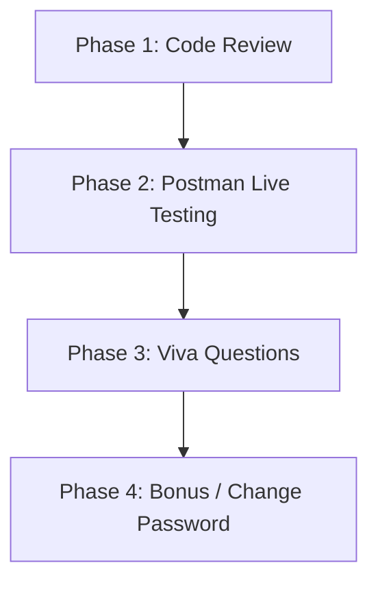

Listed directory MERN%20TA
Listed directory shopkart-backend
Viewed index.js:1-38
Viewed customer.controller.js:1-207
Viewed customer.model.js:1-32
Viewed auth.middleware.js:1-45
Viewed generateToken.js:1-20
Viewed customer.routes.js:1-28
Viewed class4.md:1-100

Here is your comprehensive **TA Preparation & Evaluation Guide** for **Engineering Lab 01 (ShopKart — Customer Authentication Service)**.

---

## 1. Quick Concept Revision (What Was Built & Why)

### A. MVC Architecture Flow
In this project, the separation of concerns is strictly maintained:
1. **[index.js](file:///Users/mdkaif/Desktop/MERN%20TA/shopkart-backend/index.js)**: Configures server, connects to MongoDB, mounts middlewares (`express.json()`, `cookieParser()`), and delegates `/customers` to routes.
2. **[customer.routes.js](file:///Users/mdkaif/Desktop/MERN%20TA/shopkart-backend/routes/customer.routes.js)**: Declares endpoints and maps them to controllers, applying `authMiddleware` where authentication is required.
3. **[customer.model.js](file:///Users/mdkaif/Desktop/MERN%20TA/shopkart-backend/models/customer.model.js)**: Defines the MongoDB Mongoose schema (`fullName`, `email`, `password`, `phone`, `createdAt`).
4. **[customer.controller.js](file:///Users/mdkaif/Desktop/MERN%20TA/shopkart-backend/controllers/customer.controller.js)**: Handles the business logic (validation, bcrypt hashing/comparison, token generation, cookie dispatch, response formatting).
5. **[auth.middleware.js](file:///Users/mdkaif/Desktop/MERN%20TA/shopkart-backend/middlewares/auth.middleware.js)**: Intercepts protected requests, verifies the JWT from cookies, retrieves the user from MongoDB, attaches the customer object to `req.user`, and calls `next()`.
6. **[generateToken.js](file:///Users/mdkaif/Desktop/MERN%20TA/shopkart-backend/utils/generateToken.js)**: Helper utility to sign JWT with customer ID and email with an expiry (e.g., `1d`).

```text
Incoming Request ──> Route ──> [authMiddleware (if protected)] ──> Controller ──> Model (MongoDB)
                                       │                                  │
                                       ▼ (if invalid token: 401)          ▼
                                                            Response (JSON + Cookie)
```

---

### B. Security & Auth Principles
* **Hashing vs. Encryption (bcrypt)**:
  * **Hashing is one-way**: You cannot reverse a hash back to the original password.
  * **Bcrypt with Salt**: Adds random salt rounds (`10`) so two identical passwords produce completely different hashes, protecting against rainbow table attacks.
* **JWT (JSON Web Token)**:
  * Signed using a server-side secret (`JWT_SECRET`).
  * Payload holds public identifiers (`id`, `email`). **Never store passwords or sensitive secrets in the payload.**
* **HttpOnly Cookie**:
  * Set via `res.cookie('token', token, { httpOnly: true, maxAge: ... })`.
  * **Prevents XSS (Cross-Site Scripting)**: JavaScript running in the browser (`document.cookie`) cannot read or manipulate the token.
* **Credential Enumeration Prevention**:
  * On login failure (wrong email OR wrong password), return the exact same generic message: `"Invalid email or password"` with HTTP `401`.

---

## 2. TA Step-by-Step Evaluation Plan

When a student presents their work, evaluate them in **4 structured phases** (~5 to 7 minutes per student):



### Phase 1: Fast Code Review (10 Marks)
1. **Folder Structure Check**: Must follow MVC (`controllers/`, `models/`, `routes/`, `middlewares/`, `utils/`, `.env`).
2. **Environment Variables**: Check that `PORT`, `MONGO_URI`, and `JWT_SECRET` are read from `.env` and not hardcoded.
3. **Password Security**:
   * Registration hashes password before saving: `await bcrypt.hash(password, 10)`.
   * Model fetch excludes password: `.select("-password")` or manual omission before `res.json()`.
4. **Cookie Security**: Ensure `httpOnly: true` is configured in `res.cookie(...)`.

---

### Phase 2: Postman API Testing Flow (70 Marks)

Follow this exact testing order in Postman:

| Step | Endpoint & Method | Test Case / Action | Expected Status | What to Verify |
| :--- | :--- | :--- | :--- | :--- |
| **1.1** | `POST /customers/register` | Send with missing field (e.g., missing `phone`) | `400 Bad Request` | Fails gracefully |
| **1.2** | `POST /customers/register` | Send with password `< 6` characters (e.g. `"123"`) | `400 Bad Request` | Password validation triggers |
| **1.3** | `POST /customers/register` | Send valid body: `{"fullName":"John Doe","email":"john@test.com","password":"password123","phone":"9876543210"}` | `201 Created` | **Password is NOT present in response JSON** |
| **1.4** | `POST /customers/register` | Send identical request again (duplicate email) | `409 Conflict` | Unique email constraint caught |
| **2.1** | `POST /customers/login` | Send unregistered email or incorrect password | `401 Unauthorized` | Generic message: `"Invalid email or password"` |
| **2.2** | `POST /customers/login` | Send valid credentials | `200 OK` | Check **Cookies tab** in Postman: `token` exists with `HttpOnly` flag enabled |
| **3.1** | `GET /customers/me` | Send request immediately after login (cookie attached) | `200 OK` | Returns customer profile (`_id`, `fullName`, `email`, `phone`) without password |
| **3.2** | `GET /customers/me` | Delete cookie or test in fresh session without login | `401 Unauthorized` | Rejects unauthenticated request |
| **4.1** | `POST /customers/logout` | Call logout endpoint | `200 OK` | Cookie is cleared |
| **4.2** | `GET /customers/me` | Call profile endpoint again after logout | `401 Unauthorized` | Confirms user is logged out |

---

### Phase 3: Bonus Task Evaluation (+10 Marks)
* **Endpoint**: `PATCH /customers/change-password`
* **Test Case**:
  1. Call while logged out $\to$ `401 Unauthorized`.
  2. Call while logged in with wrong `oldPassword` $\to$ `401 Unauthorized`.
  3. Call with valid `oldPassword` and valid `newPassword` $\to$ `200 OK`.
  4. Try logging in with the old password $\to$ fails (`401`).
  5. Try logging in with the new password $\to$ succeeds (`200`).

---

## 3. TA Evaluation Rubric (100 Marks + 10 Bonus)

| Category | Max Marks | Grading Criteria |
| :--- | :---: | :--- |
| **Register API** | **15** | Mandatory fields check (4), min 6 char password (3), duplicate email check / 409 (4), password hashed & excluded from response (4) |
| **Login API** | **15** | Email search & bcrypt comparison (5), generic error message on failure / 401 (5), successful login response (5) |
| **JWT + Cookies** | **20** | JWT signed with secret and payload (10), `HttpOnly` cookie set with expiration (10) |
| **Protected Route (`/me` & `/logout`)** | **20** | `authMiddleware` verifies token & attaches `req.user` (10), `/me` returns user without password (5), `/logout` clears cookie (5) |
| **Code Structure (MVC)** | **10** | Clean folder structure, separation of routes/controllers/models/middlewares (10) |
| **Error Handling** | **10** | Proper HTTP status codes (`400`, `401`, `409`, `500`), try/catch blocks (10) |
| **TA Viva** | **10** | Clear answers to at least 2–3 conceptual questions (10) |
| **Total** | **100** | |
| **Bonus Challenge** | **+10** | `PATCH /customers/change-password` working with old password validation and new password hashing |

---

## 4. TA Viva Questions & Expected Answers

Ask **2 to 3 questions** from this list:

#### Q1: Why do we use bcrypt hashing instead of encrypting passwords?
* **Expected Answer**: Encryption is two-way (can be decrypted with a key), meaning if the secret key is leaked, all passwords are compromised. Hashing is a one-way cryptographic algorithm (cannot be reversed). Even the database administrator cannot see the original password.

#### Q2: What information should and shouldn't be stored in a JWT payload?
* **Expected Answer**: Non-sensitive identifying information like `userId` (`_id`) and `email` should be stored. Passwords, secrets, or sensitive personal data should **never** be stored because JWT payloads are only Base64 encoded and can be decoded by anyone.

#### Q3: Why is the `HttpOnly` flag used when setting the cookie?
* **Expected Answer**: Setting `httpOnly: true` prevents client-side scripts (JavaScript via `document.cookie`) from accessing the cookie. This protects the token from Cross-Site Scripting (XSS) attacks.

#### Q4: Why shouldn't we return specific error messages like "Email not found" vs "Wrong password" during login?
* **Expected Answer**: To prevent **user enumeration attacks**. If an attacker knows the email is valid, they can target that specific account with brute-force password attacks. A generic message like `"Invalid email or password"` keeps account existence ambiguous.

#### Q5: What is the purpose of `next()` in the authentication middleware?
* **Expected Answer**: `next()` passes control to the next middleware or controller function in the Express request-response cycle. If `next()` is not called, the request hangs indefinitely.

#### Q6: Why do we use `.select("-password")` when querying the user in the auth middleware?
* **Expected Answer**: It explicitly excludes the hashed password field from the MongoDB query result, ensuring `req.user` does not hold sensitive password data in memory or accidentally return it in controller responses.

#### Q7: What role does `cookie-parser` play in Express?
* **Expected Answer**: Express cannot parse cookie headers by default. `cookie-parser` parses the `Cookie` header from incoming requests and populates `req.cookies` as a convenient JavaScript object.